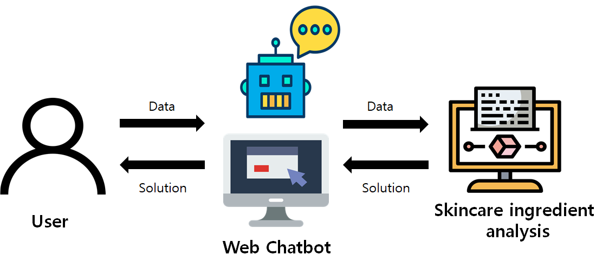

# TroubleSearch
Capstone design lecture project
피부 트러블이 발생했을 때, 그 원인이 스킨 케어 제품에 있다고 판단될 경우, 
사용한 스킨 케어의 전성분 정보를 통해 어떤 제품이 트러블을 유발했는지 찾아주는 서비스를 제공하고자 하였다.
전성분에 대한 자연어로 기술된 내용과 입력 받은 증상 간 문서 유사도를 계산한 후, 
최종적으로 산출된 제품의 유사도 값을 내림차순 정렬하여 화면에 띄워준다.

사용자는 자신의 증상과 사용 중인 스킨 케어 제품을 웹사이트에 입력하면, 
제품에 함유된 전성분 정보와 사용자의 증상 간 이를 통해 사용자는 어떤 제품이 트러블을 유발했는지 확인할 수 있다. 
그림은 이 과정을 도식화한 것이다. 
전성분에 대한 정보는 EWG(Environmental Working Group), 화해 성분 백과사전에서 다양한 성분의 자료를 확보하고자 하였고 
대한화장품산업연구원에서 공신력 있는 기관의 정보를 사용하여 보다 웹사이트 결과에 대한 신뢰도를 높이고자 했다.
